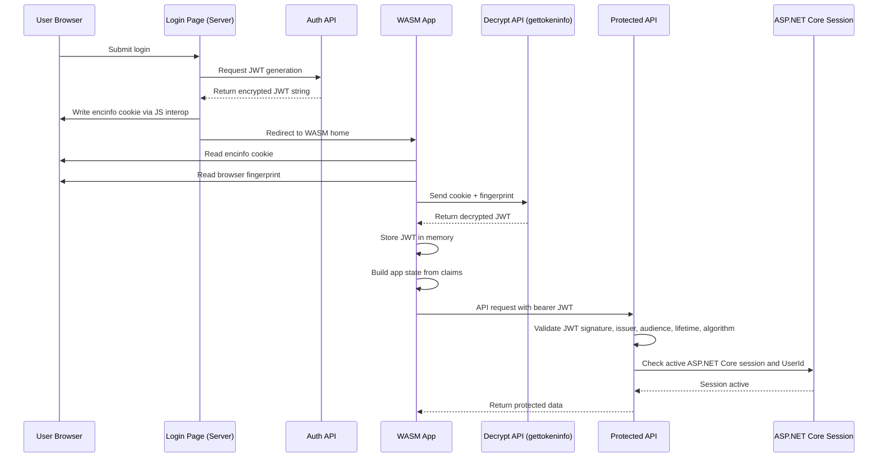

# Session Management Architecture

## Purpose

This document describes the current session management architecture used by the unified Blazor WebAssembly (WASM) and ASP.NET Core application. It is intended as a client-facing reference for development, support, troubleshooting, and future maintenance.

The application currently uses three session-related mechanisms together:

1. An encrypted application cookie (`encinfo`)
2. A JWT used as the bearer token for API authorization
3. ASP.NET Core server-side session state

These mechanisms are not redundant. Each one serves a different purpose in the application lifecycle.

## Scope

This specification covers:

- login and bootstrap flow
- cookie creation and consumption
- JWT issuance, storage, and API usage
- ASP.NET Core session usage and validation
- server-side and client-side navigation checks
- request validation points
- design intent and operational responsibilities

This document reflects the current implemented architecture as described by the application team.

## High-Level Summary

The application signs users in through a server-rendered login flow, but most of the application experience runs in the WASM client. To bridge these two runtime models:

- the server generates a JWT
- the JWT is encrypted before it is exposed to the browser page
- the page stores the encrypted JWT inside the `encinfo` cookie
- the WASM application reads that cookie and calls an API to decrypt it
- the decrypted JWT is then stored in WASM memory and sent as a bearer token on API calls

Separately:

- ASP.NET Core session is also enabled on the server
- API middleware checks whether the server session is still active
- server entry points and client navigation also check whether the application cookie exists

This creates a layered session model:

- `encinfo` establishes browser-side continuity across page reloads and application startup
- JWT authorizes API access
- ASP.NET Core session provides server-side session continuity and expiry enforcement

## Architectural Goals

The current design supports the following goals:

- avoid exposing raw JWT values directly at login time
- allow the WASM client to rehydrate its authentication state from the browser cookie
- support API authorization using standard bearer-token validation
- retain server-side session controls in addition to token validation
- redirect users quickly when the session bootstrap cookie is missing

## Core Components

| Component | Runtime | Responsibility |
| --- | --- | --- |
| Login page | Blazor server-rendered page | Authenticates the user and starts the session bootstrap flow |
| JWT generation endpoint | ASP.NET Core API | Creates the JWT and returns it as an encrypted string |
| JavaScript interop (`IJSRuntime`) | Browser via SignalR-backed server page | Writes the encrypted JWT string into the `encinfo` cookie |
| `encinfo` cookie | Browser cookie | Stores the encrypted JWT bootstrap payload |
| WASM client | Browser | Reads the cookie, decrypts it through API, stores JWT in memory, and calls APIs |
| `gettokeninfo` API | ASP.NET Core API | Decrypts the `encinfo` cookie using the browser fingerprint and returns the JWT |
| ClientJS fingerprint provider | Browser | Produces the browser fingerprint used as the decryption key for the cookie flow |
| App state | WASM memory | Holds claims and session state derived from the decrypted JWT |
| API layer | ASP.NET Core API | Validates bearer JWTs and serves application data |
| Session check filter/middleware | ASP.NET Core | Rejects API requests when the server session is not active |
| `App.razor` and router guards | Server + WASM | Redirect to login when the bootstrap cookie is missing and rebuild app state when needed |

## Security and Session Artifacts

### 1. `encinfo` Cookie

Purpose:

- browser-side persistence of the encrypted login bootstrap token
- allows the WASM application to recover authentication state after initial login or refresh

Characteristics:

- contains an encrypted JWT string rather than a plain JWT
- written from the login page through JavaScript interop
- read by the WASM client
- decrypted by an API using a browser fingerprint key

The cookie is treated as the bootstrap source of truth for client startup and route recovery.

### 2. JWT Bearer Token

Purpose:

- authorization for API calls after the client is initialized

Characteristics:

- generated by the server
- validated by standard JWT bearer authentication
- stored only in WASM memory after decryption
- sent in the `Authorization: Bearer <token>` header for API calls

The JWT is the API authorization credential, not the persistence mechanism.

### 3. ASP.NET Core Session

Purpose:

- server-side session lifetime tracking and server-aware request gating

Characteristics:

- creates the standard ASP.NET Core session cookie
- uses configured idle timeout
- is checked by server-side request interception logic
- requires a session marker such as `UserId` to be present

The server session provides an additional control layer beyond JWT validation.

## Current Authentication and Session Configuration

The application configures:

- ASP.NET Core identity application and external schemes
- JWT bearer authentication
- identity bearer token support
- identity cookies
- ASP.NET Core session

Key JWT validation rules:

- audience is validated
- issuer is validated
- expiration is validated
- signing key is validated
- only HMAC SHA-256 algorithms are accepted

The API authorization policy named `api` requires:

- an authenticated user
- authentication through the JWT bearer scheme

The server session is configured with:

- idle timeout from application settings
- `HttpOnly = true`
- `SecurePolicy = Always`
- `SameSite = Strict`
- `IsEssential = true`

## End-to-End Flow

### 1. Login and Bootstrap Flow

1. The user logs in through the Blazor server-rendered login page.
2. The login page calls a .NET Core endpoint to generate a JWT.
3. The endpoint returns an encrypted JWT string to the page.
4. The page writes the encrypted value into the browser cookie named `encinfo` through `IJSRuntime`.
5. The page redirects the user to the default home page in the WASM application.

Outcome:

- the browser now holds the encrypted bootstrap token in `encinfo`
- the application transitions from server-rendered login to WASM-driven experience

### 2. WASM Startup and Token Recovery Flow

1. The WASM app starts on the client.
2. It reads the `encinfo` cookie from the browser.
3. It obtains the browser fingerprint using the ClientJS library.
4. It calls the `gettokeninfo` API with:
   - the encrypted cookie value
   - the decryption key derived from the browser fingerprint
5. The API decrypts the cookie payload and returns the JWT.
6. The WASM app stores the JWT in memory.
7. The app reads JWT claims and uses them to populate application state.

Outcome:

- the user session is reconstructed in the WASM runtime
- the JWT is now available for API authorization

### 3. API Request Flow

1. The WASM client sends an API request.
2. The JWT stored in memory is attached as a bearer token in the HTTP authorization header.
3. The ASP.NET Core API authenticates the request using JWT bearer validation.
4. The endpoint filter or middleware also checks whether the ASP.NET Core session is still active.
5. The request proceeds only if both token and session expectations are satisfied.

Outcome:

- API access requires valid token-based identity
- API access also depends on active server-side session state

### 4. Server Session Validation Flow

The request filter validates session presence through logic equivalent to:

- session object exists
- `UserId` exists in session

If `UserId` is missing, the request is treated as having no active server session.

This means a JWT alone is not sufficient if the application expects the matching ASP.NET Core session to remain active.

### 5. Initial Server-Side Route Guard

Because the application is built on the .NET 8 web app model, `App.razor` is the first server-side entry point.

On non-login requests:

- if the bootstrap cookie is missing, the user is redirected to the login page

Purpose:

- stop unauthorized entry into the application before WASM initialization
- avoid rendering protected routes when the bootstrap cookie is absent

### 6. Client-Side Navigation Guard

The router `OnNavigateAsync` performs an additional client-side check on each navigation:

- if the cookie is missing, redirect to the auth login page
- if app state is empty, rebuild it by decrypting the cookie, reading the JWT claims, and rehydrating application state

Important current behavior:

- the first navigation always includes cookie decryption and app state population
- subsequent navigation may use existing in-memory app state
- refresh or memory loss can trigger rehydration from the cookie again

## Runtime Responsibility by Layer

### Server-Rendered Login Layer

Responsibilities:

- authenticate credentials
- obtain encrypted JWT payload
- write the encrypted bootstrap cookie
- redirect to the WASM application

Does not persist:

- raw JWT in browser storage as part of login bootstrap

### Browser Cookie Layer

Responsibilities:

- persist the encrypted bootstrap token across page transitions and refreshes
- provide the source material for client rehydration

Does not provide:

- direct API authorization by itself

### WASM Client Layer

Responsibilities:

- read the cookie
- obtain browser fingerprint
- call the decryption API
- store JWT in memory
- populate app state from claims
- attach JWT to outgoing API requests

### API Layer

Responsibilities:

- decrypt cookie payload through `gettokeninfo`
- validate JWT bearer tokens
- enforce authorization policy
- reject requests without active server session when session validation is required

### ASP.NET Core Session Layer

Responsibilities:

- track server-side session lifetime
- hold server session data such as `UserId`
- enforce expiry independently of client memory state

## Uniform Session Architecture Specification

For consistency across future development, the following rules should be treated as the intended architecture.

### Rule 1. The cookie is the bootstrap artifact

The `encinfo` cookie is the bootstrap source used to rebuild client identity after login, refresh, or empty app state.

### Rule 2. The JWT is the API credential

The decrypted JWT is the credential used for API authorization and must be sent as a bearer token on application API calls.

### Rule 3. The server session remains authoritative for server-side session continuity

If the server session expires or loses required keys such as `UserId`, the application should treat the session as invalid even if the JWT is still structurally valid.

### Rule 4. Cookie presence is required for protected route entry

Both server-side entry and client-side navigation should continue to treat the absence of the bootstrap cookie as a signal to redirect to login.

### Rule 5. App state may be rebuilt only from validated cookie-derived JWT data

When app state is empty, the client should rebuild it only by:

1. reading the cookie
2. decrypting it through the approved API
3. extracting claims from the returned JWT

### Rule 6. JWT validation rules must stay uniform across all APIs

All APIs must continue to validate:

- issuer
- audience
- lifetime
- signing key
- accepted algorithm

### Rule 7. Session checks and JWT checks serve different purposes

Developers should not remove one layer on the assumption that the other already covers it.

- JWT check answers: "Is this bearer token valid?"
- ASP.NET Core session check answers: "Is the server-side session still active?"
- cookie check answers: "Can the app bootstrap or restore client identity?"

## Request Validation Matrix

| Validation Point | Artifact Checked | Purpose | Failure Result |
| --- | --- | --- | --- |
| Login bootstrap | JWT generation endpoint result | create encrypted bootstrap token | login cannot complete |
| `App.razor` server entry | `encinfo` cookie presence | prevent entry without bootstrap artifact | redirect to login |
| Router `OnNavigateAsync` | `encinfo` cookie presence | client-side route guard | redirect to login |
| Router `OnNavigateAsync` | app state presence | rehydrate client state if needed | decrypt cookie and rebuild state |
| `gettokeninfo` | encrypted cookie + fingerprint | recover JWT from cookie | client cannot rebuild session |
| API auth pipeline | bearer JWT | authorize API request | 401/403 depending on pipeline behavior |
| endpoint filter / middleware | ASP.NET Core session and `UserId` | enforce active server session | request rejected as inactive session |

## Operational Sequence Diagram

## Failure and Expiry Scenarios

### Missing `encinfo` Cookie

Observed behavior:

- server-side entry redirects to login
- client-side navigation redirects to login

Meaning:

- the application cannot bootstrap or restore authenticated state

### Invalid Fingerprint or Cookie Decryption Failure

Observed behavior:

- WASM cannot recover the JWT from the cookie
- app state cannot be rebuilt from cookie-derived claims

Meaning:

- bootstrap persistence exists, but recovery failed

### Expired or Invalid JWT

Observed behavior:

- bearer token validation fails on APIs

Meaning:

- client memory may still hold a token, but it is not accepted for authorization

### Expired Server Session

Observed behavior:

- endpoint filter rejects requests due to missing session state such as `UserId`

Meaning:

- the API treats the server-side session as expired even if the client still presents a valid-looking JWT

## Maintenance Notes

When changing authentication or session behavior, verify all three layers together:

- cookie bootstrap
- JWT authorization
- ASP.NET Core session enforcement

Any future change should explicitly answer:

1. How is the WASM app rehydrated after refresh?
2. What authorizes API calls?
3. What terminates the server-side session?
4. What redirects the user back to login?
5. What source rebuilds app state when memory is empty?

## Recommendations for Ongoing Uniformity

The current architecture is workable, but it is multi-layered and should remain intentionally documented. To keep it maintainable:

- keep the `encinfo` cookie purpose limited to bootstrap and recovery
- keep JWT usage limited to API authorization and claims transport
- keep server session checks explicit and documented in one place
- avoid adding additional session stores unless their role is clearly distinct
- ensure support teams can identify whether a failure is cookie-related, JWT-related, or ASP.NET session-related

## Developer Troubleshooting Guide

When diagnosing authentication/session issues, check in this order:

1. Is `encinfo` present in the browser?
2. Can the cookie be decrypted with the expected fingerprint?
3. Does the resulting JWT have valid claims and expiry?
4. Is the bearer token being sent on API calls?
5. Is the ASP.NET Core session active and does it still contain `UserId`?
6. Is the user being redirected by `App.razor`, by router navigation, or by API rejection?

## Document Status

Status:

- current-state architecture specification

Intended audience:

- client stakeholders
- developers
- QA and support teams

Suggested maintenance rule:

- update this document whenever login bootstrap, cookie structure, token flow, session timeout behavior, or router/auth guards are changed
